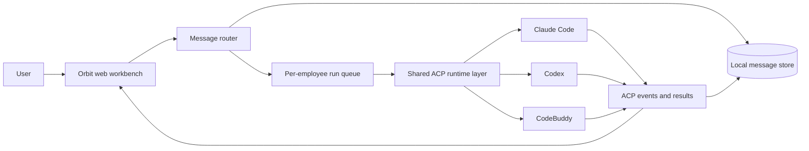

# Orbit

<p align="center">
  <a href="README.zh-CN.md">中文</a> · <strong>English</strong>
</p>

<p align="center">
  <strong>A local-first workspace for human-led collaboration with multiple AI employees.</strong>
</p>

<p align="center">
  Coordinate Claude Code, Codex, and CodeBuddy in one conversation, one workspace at a time.
</p>

<p align="center">
  <a href="https://github.com/kevinforge/orbit/actions/workflows/ci.yml"></a>
  <a href="LICENSE"></a>
  <a href="package.json"></a>
</p>

## What Orbit is

Orbit turns a local project directory into a collaborative AI workbench. You
define a team of digital employees, give each employee a role and an execution
runtime, and coordinate their work through a shared conversation. Orbit keeps
the user in control while the employees clarify requirements, design a plan,
implement changes, verify results, and hand work to one another.

The employees are powered by Claude Code, Codex, or CodeBuddy through the Agent
Client Protocol (ACP). Orbit owns the workspace, conversation history, routing,
queues, approvals, session continuity, and UI; each vendor runtime remains
responsible for its own model access and tool execution.

## 📦 Installation

If you already use Claude Code, Codex, or CodeBuddy locally, copy this prompt
to your agent:

```text
Please install Orbit for me with npm using the remote package:
npm install -g @kevinforge/orbit
Then run orbit and verify that http://localhost:4317 is available. Do not
install the unrelated public package named orbit.
```

## See it in action

Orbit can turn one unassigned goal into a supervised multi-agent workflow:
the supervisor decomposes the work, specialists investigate in parallel, a
verification employee checks the deliverables, and the supervisor produces the
final synthesis in the same conversation.


This demo was recorded from a real ACP/model run with Claude Code, Codex, and
CodeBuddy in the `复杂协作` mode. The demonstration project is isolated from
the Orbit source tree and contains no private workspace information.

## Why use it

- **One conversation, several specialists.** Keep requirements, design,
  implementation, and verification in the same visible work stream.
- **Human-directed routing.** Assign work explicitly with the employee's
  display name, or let supervised mode coordinate an unassigned goal.
- **Runtime choice per employee.** Mix Claude Code, Codex, and CodeBuddy in one
  team and change the assignment later from the UI.
- **Local-first state.** Workspaces, messages, configuration, runtime sessions,
  attachments, and transcripts are stored under `~/.orbit`.
- **Recoverable execution.** Runs are queued per employee, streamed to the UI,
  cancellable, approval-aware, and isolated by workspace and conversation.

## How it works



All three runtimes use ACP v1 over newline-delimited JSON-RPC on stdio. Orbit
maps their streamed updates into a common activity model, while runtime-specific
behavior stays inside the corresponding adapter.

## Core concepts

| Concept | Meaning |
| --- | --- |
| Workspace | A local project directory with its own employee configuration and collaboration data. |
| Conversation | A durable channel inside a workspace. Multiple conversations can run independently. |
| Digital employee | A user-configurable role with a display name, prompt, enabled state, and selected runtime. |
| Assignment | Work addressed with `@display-name:`. The display name is the public routing key; internal IDs are not. |
| Runtime session | The vendor-side ACP session restored for an employee when the next run starts. |

## Three interaction modes

Every conversation has a mode. The mode affects how messages are routed; it
does not erase an employee's persisted runtime session.

| Mode | Best for | Routing behavior |
| --- | --- | --- |
| **普通对话** (direct) | A focused conversation with one employee | Assign one employee with `@display-name:`. Later unmarked messages continue with that employee. |
| **简单协作** (collaborative) | Explicit multi-person teamwork | Assign one or more employees. Employees can hand work to one another when needed. |
| **复杂协作** (supervised) | A goal that needs decomposition and follow-up | Send an unassigned goal to the internal supervisor, which schedules the configured employees. |

The supervisor in supervised mode is an internal coordinator, not a fifth
employee. Plain `@name` text is a reference; only `@name:` starts an assignment.

Dependency-aware prompts apply to every team: independent tasks may run in
parallel, but dependent tasks wait for prerequisite results. Direct mode still
talks to one employee.

## Built-in team

The software-development template starts with four editable digital employees:

| Display name | Default responsibility |
| --- | --- |
| `范同经` | Clarify goals, scope, and acceptance criteria. |
| `甄架构` | Design solutions and evaluate implementation risk. |
| `蔡一平` | Edit files, run commands, and implement changes. |
| `田小坑` | Verify behavior and report regressions. |

Names, prompts, enabled state, and runtimes are configurable. You can also
start with a blank workspace and create your own team.

## Quick start

### Requirements

- Node.js 22 or newer.
- At least one installed and authenticated runtime: Claude Code, Codex, or
  CodeBuddy with ACP support.
- Bun is also required when building the standalone executable from source.

Orbit includes the ACP protocol adapters for Claude Code and Codex. You do not
need to install `claude-agent-acp` or `codex-acp` separately. CodeBuddy is
installed separately, for example with `npm install -g @tencent-ai/codebuddy-code`,
and must be able to run its ACP mode on the local machine.

### Run from a source checkout

```powershell
git clone https://github.com/kevinforge/orbit.git
cd orbit
npm ci
npm run build
npm run dev
```

Open [http://localhost:4317](http://localhost:4317) in your browser.

### Install a release package

Download the package for your operating system from [GitHub Releases](https://github.com/kevinforge/orbit/releases), then install it locally:

```powershell
npm install -g .\orbit-<version>-windows-x64.tgz
orbit
```

Linux and macOS users should use the package matching their platform. The
scoped npm package will be available as `@kevinforge/orbit` after public npm
publishing is enabled. Do not install the unrelated public package named
`orbit`.

### Send the first task

1. Create a workspace and select the local project directory.
2. Choose the **software development team** template, or create a blank team.
3. Open employee settings and confirm that each selected runtime is available.
4. Send an explicit assignment using the exact display name shown in the UI:

```text
@甄架构: Inspect this project and propose a small implementation plan.
```

To request independent work in parallel:

```text
@蔡一平: Implement the fix. @田小坑: Prepare the regression checklist.
```

For a supervised task, omit the assignment marker and describe the goal in
**复杂协作** mode. The internal supervisor will coordinate the enabled team.

For the full first-run walkthrough, see the [English Quickstart](docs/QUICKSTART.md)
or [中文快速上手](docs/QUICKSTART.zh-CN.md).

## Features

- Three interaction modes for direct work, explicit collaboration, and
  supervised collaboration.
- Configurable digital employees and reusable workspace team templates.
- Claude Code ACP, Codex ACP, and CodeBuddy ACP runtime adapters.
- Per-message approval modes: ask before tool operations or approve the current
  task automatically.
- Human-in-the-loop permission requests and structured elicitation forms or
  external URLs.
- Per-employee FIFO run queues, cancellation, interruption, and failure state.
- Multiple conversations with background execution and live activity updates.
- Durable message history, runtime session restoration, attachments, and
  terminal transcripts.
- Collaboration Insights for task outcomes, execution timelines, and duration
  trends.
- A local HTTP server, React UI, SSE event stream, and standalone binaries for
  supported platforms.

## Data and privacy

Orbit's own product data is stored locally under `~/.orbit`; it is not stored in
this repository. Runtime authentication and model-provider behavior are owned by
the vendor CLI you choose, so network access and account policies depend on
that runtime.

Read [Local Data](docs/DATA_DIRECTORY.md) before backing up, moving, retaining,
or resetting Orbit data. Read [Terminology And Routing](docs/TERMINOLOGY_AND_ROUTING.md)
before building integrations around employee names or assignment markers.

## Documentation map

| Need | Document |
| --- | --- |
| First run | [Quickstart](docs/QUICKSTART.md) · [中文快速上手](docs/QUICKSTART.zh-CN.md) |
| Runtime and module design | [Architecture](docs/ARCHITECTURE.md) |
| Files under `~/.orbit` | [Data Directory](docs/DATA_DIRECTORY.md) |
| Public terms and routing | [Terminology And Routing](docs/TERMINOLOGY_AND_ROUTING.md) |
| Standalone packaging | [Standalone Build](docs/standalone-build.md) |
| Development and pull requests | [Contributing](CONTRIBUTING.md) |
| Release verification | [Release Checklist](docs/RELEASE_CHECKLIST.md) |
| Support and reporting | [Support](SUPPORT.md) · [Security](SECURITY.md) |

## Development

```powershell
npm ci
npm run dev
npm run test
npm run build
npm run smoke:start
npm run smoke:port-conflict
npm run release:check
```

`npm run build` type-checks the source, builds the Vite UI, and compiles the
standalone executable with Bun. `npm run build:all` produces packages for all
supported platform targets. Before opening a pull request, run the checks that
match the changed surface and report exactly what was run.

## Project status

Orbit is being prepared as an open-source 1.0 release. The repository already
contains the CI, release, support, security, and contribution workflows used to
validate the project. See [Open Source Readiness](docs/OPEN_SOURCE_READINESS.md)
and the [release notes](docs/RELEASE_NOTES_v1.0.0-rc.1.md) for current gaps and
release-candidate context.

## Contributing

Bug reports, feature requests, and pull requests are welcome. Please read
[CONTRIBUTING.md](CONTRIBUTING.md) before changing the code. The project keeps
shared coding-agent instructions in [AGENTS.md](AGENTS.md); `CLAUDE.md` and
`CODEBUDDY.md` are thin host-specific entry points that import the same source.

## License

Orbit is released under the [MIT License](LICENSE).

## Support and security

Use [GitHub Issues](https://github.com/kevinforge/orbit/issues) for reproducible
bugs and feature requests. For security issues, follow [SECURITY.md](SECURITY.md)
instead of posting sensitive details publicly. General support expectations are
described in [SUPPORT.md](SUPPORT.md).
