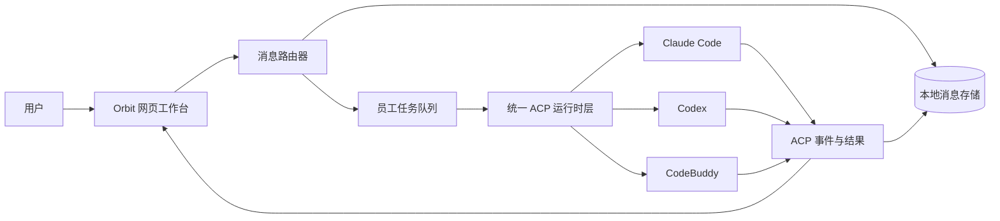

# Orbit

<p align="center">
  <strong>一个以本地优先为原则、支持人机协作的多 Agent 工作台。</strong>
</p>

<p align="center">
  在一个工作区和会话中，协调 Claude Code、Codex 与 CodeBuddy 多个数字员工共同完成任务。
</p>

<p align="center">
  <a href="https://github.com/kevinforge/orbit/actions/workflows/ci.yml"></a>
  <a href="LICENSE"></a>
  <a href="package.json"></a>
</p>

## Orbit 是什么

Orbit 可以把一个本地项目目录变成一个数字员工协作工作台。你可以创建一支由多个数字员工组成的团队，为每个员工配置角色、提示词和执行运行时，再通过一个共享会话来安排需求澄清、方案设计、代码实现、测试验证和任务交接。

员工通过 Agent Client Protocol（ACP）连接 Claude Code、Codex 或 CodeBuddy。Orbit 负责工作区、会话历史、任务路由、任务队列、审批、会话连续性和 UI；具体的模型访问与工具执行仍由用户选择的运行时负责。

## 实际协作演示

Orbit 可以把一个未指定员工的目标交给内部监工，自动组织复杂协作：监工拆解任务，多个专业员工并行调研，核验员工复核交付物，最后由监工在同一会话中完成汇总。


该 GIF 来自一次真实的 ACP/模型运行，使用了 Claude Code、Codex 和 CodeBuddy 的数字员工，并开启“复杂协作”模式。演示工程与 Orbit 源码隔离，画面中不包含个人工作区信息。

## 为什么使用 Orbit

- **一个会话，多个专业角色。** 需求、设计、实现和验证都在同一条可见的工作流中完成。
- **由人控制任务路由。** 可以明确指派某个员工，也可以在复杂协作模式下交给内部监工协调。
- **每个员工可以选择不同运行时。** 同一个团队可以混用 Claude Code、Codex 和 CodeBuddy，之后也能在 UI 中重新调整。
- **本地优先。** 工作区、消息、配置、运行时会话、附件和终端记录保存在本机 `~/.orbit`。
- **执行过程可恢复。** 每个员工都有独立任务队列，任务状态会实时显示，支持审批、取消、中断和失败恢复。

## 工作原理



三个运行时都通过 stdio 上的 ACP v1 和换行分隔的 JSON-RPC 通信。Orbit 把它们的流式更新转换成统一的活动模型，同时把运行时差异限制在各自的适配器中。

## 核心概念

| 概念 | 含义 |
| --- | --- |
| 工作区 | 一个本地项目目录，拥有独立的数字员工配置和协作数据。 |
| 会话 | 工作区中的持久化对话频道。一个工作区可以同时管理多个会话。 |
| 数字员工 | 由用户配置的角色，包含显示名称、提示词、启用状态和运行时。 |
| 指派 | 使用 `@显示名称:` 指派任务。显示名称是公开路由标识，内部 ID 不用于公开指派。 |
| 运行时会话 | 员工下一次运行时通过 ACP 恢复的供应商侧会话。 |

## 三种协作模式

每个会话都有一种协作模式。模式决定消息如何路由，但不会清除员工已经保存的运行时会话。

| 模式 | 适合场景 | 路由行为 |
| --- | --- | --- |
| **普通对话** | 与一个员工持续聚焦沟通 | 使用 `@显示名称:` 指派一个员工；后续不带标记的消息继续交给该员工。 |
| **简单协作** | 用户明确组织多个员工协作 | 可以在一条消息中指派一个或多个员工；员工在确有需要时互相交接。 |
| **复杂协作** | 需要拆解、跟进和收敛的目标 | 不写指派标记，直接描述目标，由内部监工调度已配置的员工。 |

复杂协作中的监工是内部协调器，不是第五个数字员工。普通的 `@名称` 只是文本引用，只有 `@名称:` 才会真正创建任务指派。

## 内置团队

“软件开发团队”模板默认包含四个可以编辑的数字员工：

| 显示名称 | 默认职责 |
| --- | --- |
| `范同经` | 澄清目标、范围和验收标准。 |
| `甄架构` | 设计方案并评估实现风险。 |
| `蔡一平` | 修改文件、运行命令并实现功能。 |
| `田小坑` | 验证行为并报告回归问题。 |

名称、提示词、启用状态和运行时都可以修改。你也可以创建空白工作区，完全按照自己的业务建立团队。

## 快速开始

### 环境要求

- Node.js 22 或更高版本。
- 至少安装并登录一个运行时：Claude Code、Codex，或支持 ACP 的 CodeBuddy。
- 如果要从源码构建独立可执行文件，还需要 Bun。

Orbit 已经内置 Claude Code 和 Codex 的 ACP 协议适配器，不需要额外安装 `claude-agent-acp` 或 `codex-acp`。CodeBuddy 需要单独安装，例如执行 `npm install -g @tencent-ai/codebuddy-code`，并且必须能在本机运行 ACP 模式。

### 从源码运行

```powershell
git clone https://github.com/kevinforge/orbit.git
cd orbit
npm ci
npm run build
npm run dev
```

然后在浏览器打开 [http://localhost:4317](http://localhost:4317)。

### 安装发布包

从 [GitHub Releases](https://github.com/kevinforge/orbit/releases) 下载与你的操作系统匹配的安装包，然后在本地安装：

```powershell
npm install -g .\orbit-<version>-windows-x64.tgz
orbit
```

Linux 和 macOS 用户请使用对应平台的 `.tgz` 包。公开 npm 发布启用后，包名会是 `@kevinforge/orbit`。不要安装公开 npm 上那个无关的 `orbit` 包。

### 发出第一条任务

1. 创建工作区并选择本地项目目录。
2. 选择“软件开发团队”模板，或者创建空白团队。
3. 打开数字员工设置，确认每个员工选择的运行时可用。
4. 使用 UI 中显示的准确名称发出指派：

```text
@甄架构: 检查这个项目的结构，并提出一个尽量小的实现方案。
```

如果希望并行安排独立工作：

```text
@蔡一平: 实现这个修复。@田小坑: 准备回归检查清单。
```

在“复杂协作”模式下，也可以不写指派标记，直接描述目标，由内部监工协调启用的团队。

完整的第一次使用流程请阅读[中文快速上手](docs/QUICKSTART.zh-CN.md)，英文读者可以阅读 [Quickstart](docs/QUICKSTART.md)。

## 功能

- 支持普通对话、明确协作和监工协作三种模式。
- 支持自定义数字员工和可复用的工作区团队模板。
- 支持 Claude Code ACP、Codex ACP 和 CodeBuddy ACP 运行时适配器。
- 每条消息支持“向我审批”或“当前任务完全批准”两种审批模式。
- 支持人工处理权限请求，以及表单和外部 URL 两种结构化反问。
- 每个员工拥有 FIFO 任务队列，支持取消、中断和失败状态管理。
- 支持多个会话后台运行，并实时显示员工活动。
- 持久化保存消息历史、运行时会话、附件和终端记录。
- 提供协作洞察，展示任务结果、执行时间线和耗时趋势。
- 使用本地 HTTP 服务、React UI、SSE 事件流和跨平台独立可执行文件。

## 数据与隐私

Orbit 自身的产品数据保存在本机 `~/.orbit`，不会写入当前代码仓库。运行时的登录状态、模型服务和网络行为由你选择的供应商 CLI 决定，因此需要遵循对应供应商的账号和网络策略。

在备份、迁移、保留或重置 Orbit 数据前，请先阅读[本地数据目录说明](docs/DATA_DIRECTORY.md)。如果要基于员工名称或指派标记开发集成，请先阅读[术语与路由规则](docs/TERMINOLOGY_AND_ROUTING.md)。

## 文档索引

| 需求 | 文档 |
| --- | --- |
| 第一次使用 | [中文快速上手](docs/QUICKSTART.zh-CN.md) · [Quickstart](docs/QUICKSTART.md) |
| 运行时与模块设计 | [Architecture](docs/ARCHITECTURE.md) |
| `~/.orbit` 文件布局 | [Data Directory](docs/DATA_DIRECTORY.md) |
| 产品术语与路由规则 | [Terminology And Routing](docs/TERMINOLOGY_AND_ROUTING.md) |
| 独立可执行文件和安装包 | [Standalone Build](docs/standalone-build.md) |
| 开发与 Pull Request | [Contributing](CONTRIBUTING.md) |
| 发布验证 | [Release Checklist](docs/RELEASE_CHECKLIST.md) |
| 支持与安全问题 | [Support](SUPPORT.md) · [Security](SECURITY.md) |

## 开发

```powershell
npm ci
npm run dev
npm run test
npm run build
npm run smoke:start
npm run smoke:port-conflict
npm run release:check
```

`npm run build` 会进行 TypeScript 类型检查、构建 Vite UI，并使用 Bun 编译独立可执行文件。`npm run build:all` 会为所有支持的平台生成安装包。提交 Pull Request 前，请根据改动范围运行对应检查，并准确报告实际执行过的命令。

## 项目状态

Orbit 正在准备开源 1.0 版本。仓库已经包含用于验证项目的 CI、发布、支持、安全和贡献流程。当前的缺口和发布候选背景见[开源准备情况](docs/OPEN_SOURCE_READINESS.md)以及[发布说明](docs/RELEASE_NOTES_v1.0.0-rc.1.md)。

## 参与贡献

欢迎提交 Bug、功能建议和 Pull Request。修改代码前请先阅读[贡献指南](CONTRIBUTING.md)。项目的共享 Agent 规则集中在 [AGENTS.md](AGENTS.md)；`CLAUDE.md` 和 `CODEBUDDY.md` 是导入同一份规则的宿主适配入口。

## 许可证

Orbit 使用 [MIT License](LICENSE) 开源。

## 支持与安全

可复现的 Bug 和功能建议请提交到 [GitHub Issues](https://github.com/kevinforge/orbit/issues)。安全问题不要公开发布，请按照 [SECURITY.md](SECURITY.md) 的流程报告。一般支持范围见 [SUPPORT.md](SUPPORT.md)。
